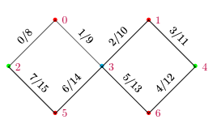

## Specifying experimental configuration

The goal of the config is to specify the information required by the compiler which compile user-defined C++ or Python program into 1) QISA instructions with corresponding microcode for CC-Light, or 2) qumis instructions for CBox_v3. It should be emphasized that flexibility and extensibility of this format is a driving requirement.  The config is specified in JSON and contains a nested dictionary with the required information for **every** allowed operation including it's arguments.  If there is no entry in the configuration for a specific operation with it's arguments then it is not allowed.  There is a different entry in the configuration for different arguments of the same function: e.g., `X180(q0)` and `X180(q1)` would be two distinct entries in the config. In addition to the configuration entries there are several globally defined parameters.

## Globally defined parameters

- `qubit names` (list) : list of qubit names (not needed?)
- `cycle_time` (int) : the clock cycle time of the device running the qumis

- `MW_MW_buffer` (int) : buffer between pulses of type MW and MW in ns
- `MW_Flux_buffer` (int) : buffer between pulses of type MW and Flux in ns
- `MW_RO_buffer` (int) : buffer between pulses of type MW and RO in ns
- `Flux_MW_buffer` (int) : buffer between pulses of type Flux and MW in ns
- `Flux_Flux_buffer` (int) : buffer between pulses of type Flux and Flux in ns
- `Flux_RO_buffer` (int) : buffer between pulses of type Flux and RO in ns
- `RO_MW_buffer` (int) : buffer between pulses of type RO and MW in ns
- `RO_Flux_buffer` (int) : buffer between pulses of type RO and Flux in ns
- `RO_RO_buffer` (int) : buffer between pulses of type RO and RO in ns

## Configuration entries
Entries are either an `alias` or a full entry.

`entry` (str) : unique id for the operation with arguments formatted as `op_name(arg1, ..., argN)`

- `alias` entries only contain one item:
    + `alias` (str) : name of operation +args it is an alias of
- full entries contain the following pieces of information
    + `duration` (int) : duration of the operation in ns
    + `latency` (int): latency of operation in ns
    + `qubits` (list) : what qubits this operation affects (can be empty list)
    + `type`: one of either `MW`, `Flux`, `RO`, `None`.
    + `matrix` (matrix): the process matrix, can be an empty matrix.
    + 'disable_optimization' (bool): if this is True this operation cannot be compiled away. 
    + type (str): one of either `MW`, `Flux`, `RO`, `None`
    + `qumis_instr` (str): one of `wait`, `pulse`, `trigger`, `CW_trigger`, `dummy`, `measure`.
    + `qumis_instr_kw` (dict): dictionary containing keyword arguments for the qumis instruction. 

## CBox_v3 instuction configuration
OpenQL supports the following instructions

- `wait`
    + time (int): time to wait in ns, must be multiple of `cycle_time`
- `pulse` plays a waveform from one of the internal AWG's
    + awg_nr (int): index specifying the awg to play the pulse on
    + lut_idx (int) : index of the lookuptable that stores the waveform
- `trigger` : raises a trigger for a specified time
    + `trigger_bit` (int) : trigger_bit
    + `trigger_duration` (int): duration for which to set the trigger bit high
- `codeword_trigger` : 
    + `codeword_ready_bit` (int) : codeword_ready_bit
    + `codeword_ready_bit_duration` (int): duration for which to set the codeword_ready_bit high
    + `codeword_bits` (list of int) : bits available for specifying the codeword (bit mask specifying used bits)
    + `codeword_duration` (int): duration for which to set the codeword bits high
    + `codeword` (int) : integer value the codeword bits should present in binary format.
- `dummy` blocks the qubit for the duration specified but executes no instruction
    + no arguments
- `measure`
    + no arguments

## CC-Light instuction configuration
Every quantum operation (QISA instruction) is translated into one or multiple microinstructions. For the first release of CC-Light, only one microinstruction is supported. It should contain the following information:

- `name` (str):  the name of the operation in the program.
- `physical qubits` (int): the address of targeted physical qubits. A list containing up to two integers ranging from 0 to 6. Can be empty. See appendix for more details.
- `type`: (int): 0 for single-qubit gates, 1 for two-qubit gates.
- `op_left type`: one of either `MW`, `Flux`, `RO`, `None`.
- `op_left` (int): 0\~255 for MW, 0\~7 for flux. Otherwise omiited.
- `lut_idx` (int) : index of the lookuptable that stores the waveform.
- `op_right type`: one of either `MW`, `Flux`, `RO`, `None`.
- `op_right` (int): 0\~255 for MW, 0\~7 for flux. Otherwise omiited.
- `lut_idx` (int) : index of the lookuptable that stores the waveform.

## Potential extensibility and current flaws

- **New qumis instructions** will be needed as hardware changes (e.g., vector switch matrix) or to support different platforms (spin-qubits, NV-centers, etc). This should not affect the structure of this config but will change the content in the future.
- **Classical logic** is not specified in this document but does relate to the underlying qumis instructions, e.g, operations conditional on measurement outcomes.
- **Composite qumis instructions**. In the current proposal it is not possible to specify composite qumis instructions even though there is a clear potential for this. An example would be quickly putting a copy of a pulse on a different channel or triggering a scope.
- The format is flattened out completely, not taking use of any structure in the configuration. This is on purpose.

## Example use of aliases

- CZ(q0, q1) -> CZ(q1, q0)
- CZ_11(q0, q1) -> CZ_11(q1, q0)
- CZ_01(q0, q1) -> CZ_10(q1, q0)

- X180(q0) -> X(q0)
- X180(q0) -> rX180(q0)

## Appendix: Device channel to qubit mapping
A mapping is required to map the user-defined qubit name into a physical qubit address. The physical qubit address and the directed edge address are defined in the following figure and table:

| edge address| left qubit address | right qubit address|
|----|:------:|:------------:|
|0   |   2    | 0 |
|1   |   0    | 3 |
|2   |   3    | 1 |
|3   |   1    | 4 |
|4   |   2    | 5 |
|5   |   5    | 3 |
|6   |   3    | 6 |
|7   |   6    | 4 |
|8   |   0    | 2 |
|9   |   3    | 0 |
|10  |   1    | 3 |
|11  |   4    | 1 |
|12  |   5    | 2 |
|13  |   3    | 5 |
|14  |   6    | 3 |
|15  |   4    | 6 |

In the CC-Light architecture, the following connection is suppoed:

| Device Name | DIO connector | Target qubits | Operation Type|
|-------------------|:----:|:--------------:|-------------|
|UHFQC-0            | DIO1 | 0, 2, 3, 5, 6  | measurement |
|UHFQC-1            | DIO2 |   1, 4         | measurement |
|AWG-8 0, channel 0~6 | DIO3 |   0~6          | flux |
|AWG-8 1, channel 0 | DIO4 |   0,1          | microwave |
|AWG-8 1, channel 1 | DIO4 |   5,6          | microwave |
|AWG-8 2, channel 0 | DIO5 |   2,3,4        | microwave |
|VSM                |  -   |   0~6          | microwave masking |

### Potential change requirements & Solutions
- The user would like to use AWG-8 2, instead of AWG-8 1 to drive qubit 5,6.
  + Solution: Switch the DIO connection of AWG-8 1 and 2.
- How address a single qubit?
  + Solution: For MW, use VSM to shield other qubits. For flux, only activiate the channel for that qubit. For measurement, only generate the trigger bit for that qubit. If the program is written for a single qubit, then it can be automatically done.
- How to use the same program to address two different qubits in two experiments?
  + Solution: Change the qubit mapping in the config file. For example, the first experiment, the qubit name "target_qubit" is mapped to physical qubit address 0, and in the second experiment, change this mapping to physical qubit 1.
- Is it possible to only change the flux channel 1 and 4 for qubit 1 and 4, respectively, while not affecting the MW channel?
  + This is not allowed by CC-Light.
