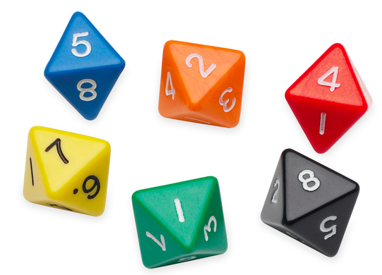
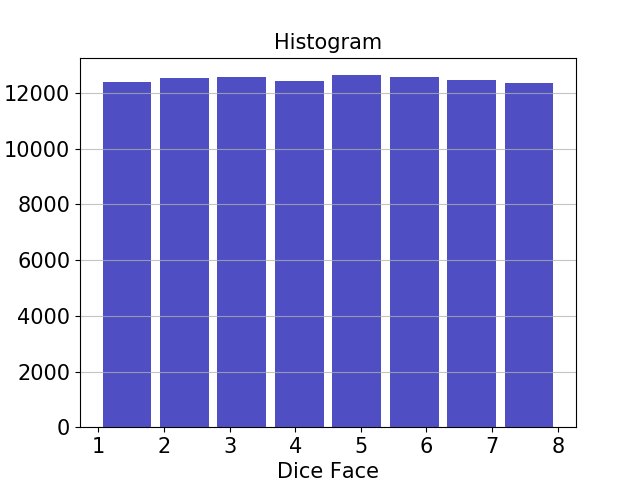

QX Simulation
=============

This tutorial explains how to compile an OpenQL program and execute it on QX. We will use the example of rolling an 8-faced dice. Rolling this dice results in 1 out of 8 outcomes. The complete code for this example is available in ``examples/dice.py``. You can also copy the snippits over to your own script as we walk through it.

OpenQL Program
--------------

We start by importing openql, qxelerator and some python packages. We also set some options for openql. For this example we will be using 3 qubits. All this is done by the following code snippet:

.. code:: python

	from openql import openql as ql
	import qxelarator
	from functools import reduce
	import os
	import matplotlib.pyplot as plt

	curdir = os.path.dirname(__file__)
	output_dir = os.path.join(curdir, 'test_output')

	ql.set_option('output_dir', output_dir)
	ql.set_option('write_qasm_files', 'yes')
	ql.set_option('scheduler', 'ASAP')
	ql.set_option('log_level', 'LOG_INFO')

	nqubits = 3

Next we create a platform, a program and a kernel. We populate the kernel with 3 hadamard gates being applied on each qubits. This will put each qubit in superposition. Measuring each qubit will collapse the state resulting in getting either 0 or 1. This is done by dice_compile() as shown below:

.. code:: python

	def dice_compile():
	    print('compiling 8-face dice program by openql')
	    config = os.path.join(curdir, '../tests/hardware_config_qx.json')

	    platform = ql.Platform("myPlatform", config)
	    p = ql.Program('dice', platform, nqubits)
	    k = ql.Kernel('aKernel', platform, nqubits)

	    for q in range(nqubits):
	        k.gate('h', [q])

	    for q in range(nqubits): 
	        k.gate('measure', [q])

	    p.add_kernel(k)
	    p.compile()

Compiling the above code snippet will produce the following quantum assembly code in `cQASM v1.0 <https://arxiv.org/abs/1805.09607>`_ format:

- test_output/dice.qasm which is the generated un-scheduled qasm code
- test_output/dice_scheduled.qasm which is the generated qasm code after scheduling 

For instance, dice.qasm contents are shown below:

.. parsed-literal::

	version 1.0
	# this file has been automatically generated by the OpenQL compiler please do not modify it manually.
	qubits 3

	.aKernel
	    h q[0]
	    h q[1]
	    h q[2]
	    measure q[0]
	    measure q[1]
	    measure q[2]

These cQASM codes can be simulated on `QX simulator <https://github.com/QE-Lab/qx-simulator>`_. For this we are using the simplified python interface to QX known as `QXelarator <https://github.com/QE-Lab/qx-simulator/tree/develop/qxelarator>`_. This is done by the following code snippet:

.. code:: python

	def dice_execute_singleshot():
	    print('executing 8-face dice program on qxelarator')
	    qx = qxelarator.QX()

	    # set the qasm to be executed
	    qx.set('test_output/dice.qasm')

	    # execute the qasm
	    qx.execute()

	    # get the measurement results
	    res = [int(qx.get_measurement_outcome(q)) for q in range(nqubits)]

	    # convert the measurement results from 3 qubits to dice face value
	    dice_face = reduce(lambda x, y: 2*x+y, res, 0) + 1
	    print('Dice face : {}'.format(dice_face))

Running ``dice.py`` will produce output as shown below:

.. parsed-literal::

	Dice face : 2

where, the Dice face can be any number between 1 and 8.

Next we can also roll the dice 100000 times and plot the frequency of occurance of each face by the following code snippet:

.. code:: python

	def plot_histogram(dice_faces):
	    plt.hist(dice_faces, bins=8, color='#0504aa',alpha=0.7, rwidth=0.85)
	    plt.grid(axis='y', alpha=0.75)
	    plt.xlabel('Dice Face',fontsize=15)
	    plt.ylabel('Frequency',fontsize=15)
	    plt.xticks(fontsize=15)
	    plt.yticks(fontsize=15)
	    plt.ylabel('Frequency',fontsize=15)
	    plt.title('Histogram',fontsize=15)
	    plt.show()
	    plt.savefig('hist.png')

	def dice_execute_multishot():
	    print('executing 8-face dice program on qxelarator')
	    qx = qxelarator.QX()
	    qx.set('test_output/dice.qasm')
	    dice_faces = []
	    ntests = 100
	    for i in range(ntests):
	        qx.execute()
	        res = [int(qx.get_measurement_outcome(q)) for q in range(nqubits)]
	        dice_face = reduce(lambda x, y: 2*x+y, res, 0) +1
	        dice_faces.append(dice_face)

	    plot_histogram(dice_faces)

This will produce the histogram similar to the one shown below:

